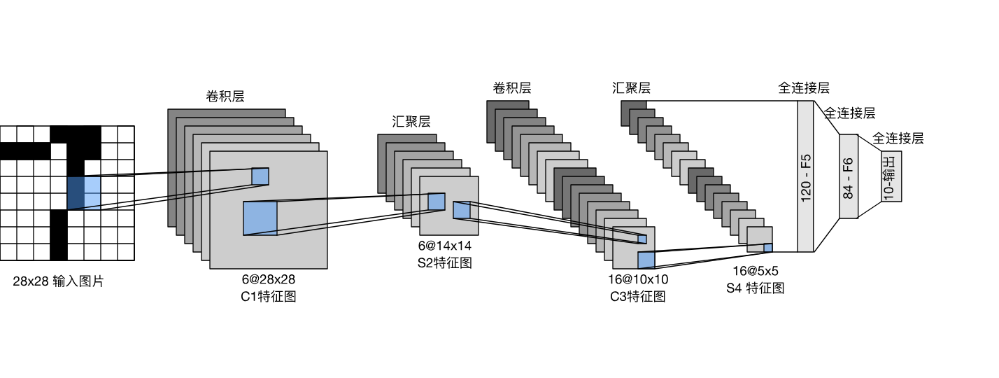
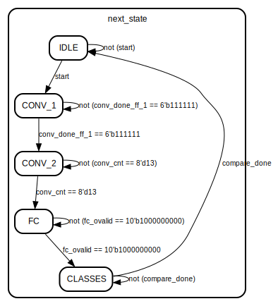

# BNN_on_fpga  

## 项目概述  

这个项目是一个基于 FPGA 的二值神经网络（Binary Neural Network，BNN）加速器，旨在加速 MNIST 数据集的手写数字识别任务，通过训练不同数据集，也可以用于其他任务，如fashionMNIST，cifar10（需要改通道数，重新调整时序）等。  
二值化神经网络（BNN）是指仅使用+1和-1两个值来表示权重的神经网络，相比于全精度的神经网络，它可以使用XOR+popocount这样的简单组合代替fp32的乘加来实现卷积操作，从而大大节省内存，减少计算开销。

本项目开源在了github上面，地址如下。
[项目地址](https://github.com/curryfromuestc/curry_code_summay/tree/main/rtl_works/BNN_on_fpga)
## 网络结构  

  

上图为经典的LeNet5网络，本项目为了减小复杂度，将三个全连接减少为一个，实际测试中并没有准确率下降。
lenet 2conv3fc  
1bit量化，权重只为1或者-1  
LeNet(  
  (conv1): BinaryConv2d(1, 6, kernel_size=(5, 5), stride=(1, 1), bias=False)  
  (pool1): MaxPool2d(kernel_size=2, stride=2, padding=0, dilation=1, ceil_mode=False)  
  (relu1): ReLU()  
  (conv2): BinaryConv2d(6, 12, kernel_size=(5, 5), stride=(1, 1), bias=False)  
  (pool2): MaxPool2d(kernel_size=2, stride=2, padding=0, dilation=1, ceil_mode=False)  
  (relu2): ReLU()  
  (fc1): BinaryLinear(in_features=192, out_features=10, bias=False)  
)
## 硬件架构  

  

conv1的输入是（1，28，28），输出通道为6，所以直接将并行度设置为6，第二个卷积层的输入通道为6，输出通道为12，所以一共是13次卷积操作。  

### 卷积模块

首先是卷积的滑窗模块，由于卷积核尺寸是5*5，所以滑窗模块预存的是28*5=140个像素，需要支持两种模式，第一种模式的输入是28*28，第二种是在经过第一个卷积层和第二个池化层过后，输入变成了12*12，所以预存的像素点变成了12*5=60个，由于对于每五行，从上到下，从左到右读入mem中，所以第一个读入的点应该位于mem的最高位。

接下来是对该模块进行仿真，需要将图片转化为txt文件，每一行一个像素，用八位二进制无符号数表示。  

接下来是卷积模块的核心部分，卷积相乘的部分，由于所有的权重都已经量化为了1bit，所以我们人为规定，1代表权重为1，0代表权重为-1，转化为硬件电路里面，便是为1时加上这个激活值，为0时减掉这个激活值。激活值与权重对应相乘结束过后，进行流水线操作进行结果相加，一共是7级流水线。  

执行流程如下  

- 加载权重矩阵，一共是150个周期，因为并行度是6，所以是6*5*5=150  
- 在滑窗模块加载完过后，还需要4个周期，流水线的第一次运行还需要7个周期，一共就是161个周期。  
- 在卷积计算完成的时候，因为输出是24*24，所以在这里需要移位24*24次，同时滑窗模块换行的时候，需要进行同步操作，一共换行23次，所以是23*4次，加起来就是829  

仿真部分，硬件模拟软件，首先用pytorch生成一个卷积，权重全为-1，  

```python
conv = nn.Conv2d(1, 1, 5, 1, 0, bias=False)  
conv.weight.data.fill_(-1)  
output = conv(image)  
```  

卷积完的结果如下  
  
同时用硬件进行仿真，结果打印在控制台上面，如下图所示
 
可以看到，结果是一样的，说明卷积模块的功能是没有问题的。  
### 最大池化层  
池化层的尺寸是2*2,首先缓存两行输入数据，接着通过一个二级流水线，先让下面的两个像素点分别与对应的第一行的像素点比大小，然后设置一个寄存器保存最大值，然后将该寄存器的两个值进行大小比较，最终输出最大值。  
仿真方法与卷积模块结果一样  
  
  
### 全连接模块  
由于网络第二层一共有12个输出通道，feature map大小是16，所以全连接层一共接收12个输入，流水线级接受16次，最终4级累加到最后结果。
  


### top模块  

最初版本的top将所有模块直接例化，如下图所示。  
  
在实际过程中调度过于复杂，波形信号有几百条，最终决定做一个化繁为简的操作，将卷积模块，池化模块，ReLU模块进行合并，通过再多添加流水线实现卷积后的池化和激活操作。  
第二版例化六个融合卷积模块，10个全连接，最后再通过五级流水线输出最大值以及对应类别。  
权重被存在了ROM当中，将pth文件的权重导出为coe文件，到BRAM的IP核配置界面进行加载，一开始权重晚于地址一个clk读出，但是由于IP核是在综合过后加入仿真的，因此存在一定的偏移和延迟，于是进行了打拍处理。
运算过程的状态机如图所示。  


## 项目总结  

这个项目verilog代码一共有7000多行，已经是一个比较大的工程了，在此之前，本人也未独自完成一个神经网络加速器的全部流程，因此在项目执行过程中遇到了很多问题。

- 最初的验证方案未确定完全，后期多次修改Jupyter里面的python代码进行打印调试，浪费了很多时间。  
- 最初对于卷积的运算顺序并未考虑清楚，比如在第二层卷积运算完全进行通道相加的时候出现顺序错误。  
- 因为本人并未掌握UVM验证方法学，所以没有通过打印checkpoint的方法进行调试，实际执行时仍然采用用verilog写tb，然后看波形的方法，消耗了大量时间。