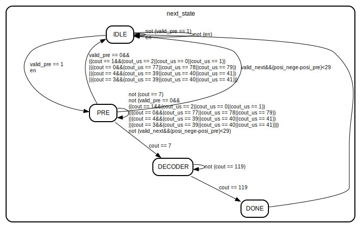

# Entity: decoder_core 
- **File**: decoder_core.v

## Diagram

## Ports

| Port name | Direction | Type    | Description |
| --------- | --------- | ------- | ----------- |
| clk       | input     |         | 输入时钟        |
| rst_n     | input     |         |             |
| en        | input     |         |             |
| data_in   | input     | [7:0]   |             |
| data_out  | output    | [223:0] |             |
| valid_out | output    |         |             |

## Signals

| Name          | Type       | Description        |
| ------------- | ---------- | ------------------ |
| accumerlator  | reg [31:0] | 累加器,用于累加权重与数据相乘的结果 |
| addra         | reg [6:0]  | ROM的地址             |
| douta_w       | wire       | ROM的输出             |
| cout          | reg [6:0]  | 统计从第一微秒到第120微妙的数据  |
| cout_us       | reg [6:0]  | 每一微秒的八十个脉冲进行计数     |
| state         | reg [1:0]  | 状态机的状态             |
| next_state    | reg [1:0]  | 状态机的状态             |
| valid_pre     | reg        | 上升沿有效的信号           |
| valid_next    | reg        | 下降沿有效的信号           |
| posi_pre      | reg        | 上升沿和下降沿的位置         |
| posi_nege     | reg        | 上升沿和下降沿的位置         |
| valid_decoder | reg        | 进入解码状态的有效信号        |
| data_in_pre_1 | reg [7:0]  | 缓冲data_in          |
| data_in_pre_2 | reg [7:0]  | 缓冲data_in          |

## Constants

| Name      | Type | Value | Description    |
| --------- | ---- | ----- | -------------- |
| threshold |      | 50    | 阈值             |
| IDLE      |      | 2'b00 | 空闲状态           |
| PRE       |      | 2'b01 | 准备状态，判断前挡脉冲的状态 |
| DECODER   |      | 2'b11 | 解码状态           |
| DONE      |      | 2'b10 | 完成这包数据的解码的状态   |

## Processes
- next_state_logic: ( @(posedge clk or negedge rst_n) )
  - **Type:** always
  - **Description**
 下一状态逻辑 
- state_transfer_logic: ( @( *) )
  - **Type:** always
  - **Description**
 状态转移逻辑 
- valid_logic: ( @(posedge clk or negedge rst_n) )
  - **Type:** always
  - **Description**
 对数据进行打怕，然后比对，确定上升沿还有下降沿的位置 
- output_logic: ( @(posedge clk or negedge rst_n) )
  - **Type:** always
  - **Description**
 不同状态的输出逻辑 
- decoder_logic: ( @(*) )
  - **Type:** always
  - **Description**
 将累加器的值与训练出来的阈值进行比较，然后进行解码 

## Instantiations

- blk_mem_gen_0_inst: blk_mem_gen_0
  - 实例化ROM
## State machines

- 状态转移逻辑