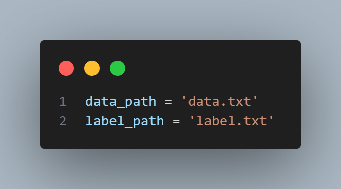

首先对于python工具，用于生成一微秒里面80个对应的权重，先安装相关的工具包，已经整理好放在requirements.txt里面，通过如下指令安装。

```
pip install -r requirements.txt
```

建议配置在虚拟环境里面，anaconda的下载链接可以去清华源找

[清华源](https://mirrors.tuna.tsinghua.edu.cn/anaconda/)

下载后需要手动配置环境变量，参照

[https://mirrors.tuna.tsinghua.edu.cn/anaconda/](https://mirrors.tuna.tsinghua.edu.cn/anaconda/)

运行脚本，BNN.py是二值化神经网络的基本组件，相关的类都在里面，fc.py用于训练，需要将txt格式的训练集和标签导入



这里data_path和label_path修改为相应路径，运行过后会生成一个model.pth文件，接着运行to_coe.py，用于将pth文件中的权重转化为coe文件，coe文件用于在VIVADO里面初始化ROM。
